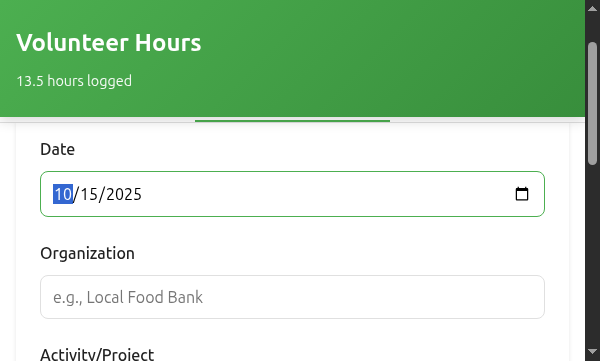
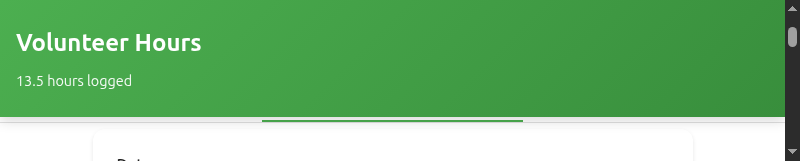
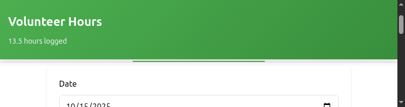
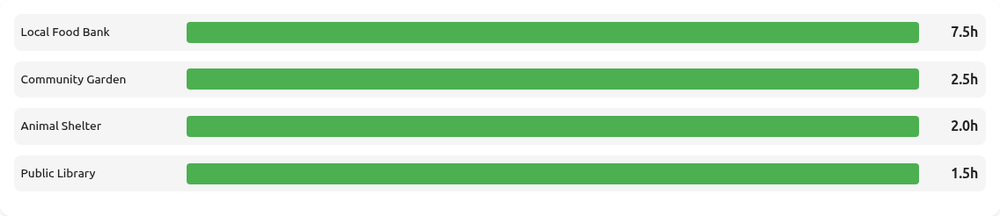
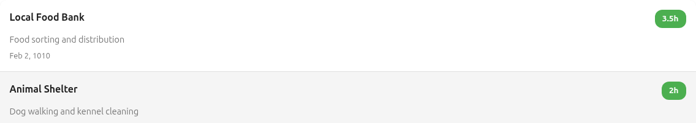
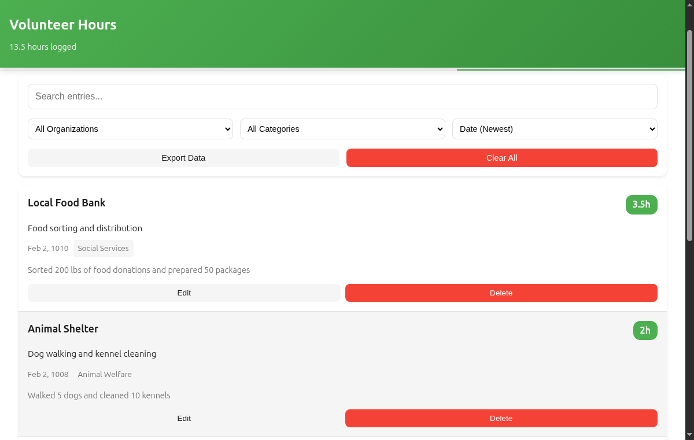
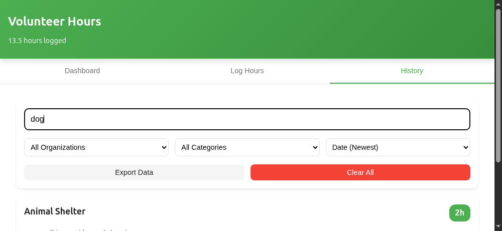
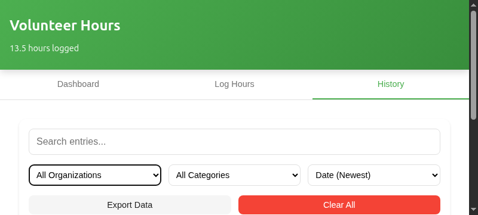
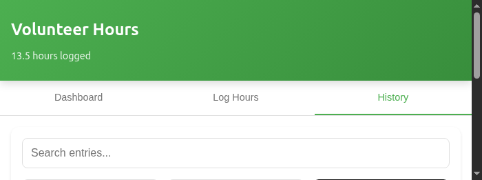
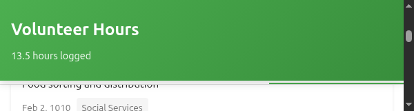

# Volunteer Hours Tracker - Getting Started Tutorial

**Version 1.0** | Last Updated: October 2025

Welcome! This tutorial will walk you through your first 10 minutes with the Volunteer Hours Tracker. By the end, you'll know how to log your volunteer hours, view your impact, and manage your volunteer history.

---

## What You'll Learn

In this tutorial, you'll:
1. ✅ Open and explore the app
2. ✅ Log your first volunteer entry
3. ✅ View your volunteer statistics
4. ✅ Search and filter your entries
5. ✅ Edit and manage your history
6. ✅ Export your data

**Time Required:** 10 minutes

---

## Step 1: Open the App (1 minute)

### Option A: On Your Computer

1. **Locate the app files** on your computer
2. **Double-click `index.html`** to open in your browser
3. The app opens automatically - no installation needed!


### Option B: On Your Phone (Recommended!)

1. **Open the app URL** in your mobile browser (Chrome or Safari)
2. **Tap the Share button** (iOS) or **menu** (Android)
3. **Select "Add to Home Screen"**
4. **Tap the new app icon** on your home screen


**Why mobile?** Log your hours right after volunteering - no need to remember later!

### What You Should See

The app opens with three tabs at the top:


- **📊 Dashboard** - Your volunteer statistics
- **➕ Log Hours** - Add new entries
- **📋 History** - View all your entries

---

## Step 2: Log Your First Volunteer Entry (3 minutes)

Let's log a volunteer activity! We'll use a real example.

### 2.1 Click the "Log Hours" Tab


### 2.2 Fill in the Required Information

**Example: Food Bank Volunteering**

#### Date (Required)
Click the date field and select when you volunteered. Let's say October 10, 2025.



**Tip:** You can select any past date, but not future dates.

---

#### Organization (Required)
Type the name of the organization. Let's use "Local Food Bank".


**Tip:** After you enter an organization once, the app will suggest it next time!

---

#### Activity/Project (Required)
Describe what you did. Let's enter "Food sorting and distribution".



**Tip:** Be specific! "Food sorting" is better than just "volunteering".

---

#### Hours (Required)
How long did you volunteer? Let's say 3.5 hours (3 hours and 30 minutes).


**Quick Reference:**
- 30 minutes = 0.5 hours
- 1 hour 15 minutes = 1.25 hours
- 2 hours 30 minutes = 2.5 hours

---

### 2.3 Add Optional Details (Makes Your Records Better!)

#### Category (Optional but recommended)
Select a category. For our food bank example, choose "Social Services".


**Available categories:**
- Education
- Environment
- Health
- Social Services
- Arts & Culture
- Animal Welfare
- Community Development
- Other

---

#### Description (Optional but helpful)
Add extra details. For example: "Sorted 200 lbs of food donations and prepared 50 food packages for families."



**Why add a description?** It helps you remember the impact you made!

---

### 2.4 Click "Add Entry"

Your form should look like this:


Click the green **"Add Entry"** button at the bottom.


### 2.5 Success!

You'll see a green success message, and the app automatically switches to the History tab to show your new entry.


**🎉 Congratulations!** You've logged your first volunteer entry!

---

## Step 3: View Your Dashboard (2 minutes)

Now let's see your volunteer impact!

### 3.1 Click the "Dashboard" Tab


### 3.2 View Your Statistics

At the top, you'll see four key numbers:


1. **Total Hours** - All the volunteer hours you've logged (3.5 hours)
2. **Total Entries** - Number of volunteer sessions (1 entry)
3. **Organizations** - How many different organizations (1 organization)
4. **This Month** - Hours volunteered this month (3.5 hours)

### 3.3 View Your Charts

Scroll down to see the **"Hours by Organization"** chart:



This bar chart shows which organizations you've helped the most. As you add more entries, this chart will grow!

### 3.4 View Recent Activity

Below the chart, you'll see your **Recent Activity**:



This shows your last 5 volunteer entries with:
- Organization name
- Activity description
- Hours volunteered
- Date

**Tip:** This is a quick way to see what you've been doing lately!

---

## Step 4: Add More Entries (Practice!) (2 minutes)

Let's add a couple more entries so you can see how the app works with multiple records.

### Example 2: Animal Shelter

Click **"Log Hours"** tab and enter:

```
Date: October 8, 2025
Organization: Animal Shelter
Activity: Dog walking and kennel cleaning
Hours: 2
Category: Animal Welfare
Description: Walked 5 dogs and cleaned 10 kennels
```


Click **"Add Entry"**.

### Example 3: Library

Add one more:

```
Date: October 5, 2025
Organization: Public Library
Activity: Reading program for children
Hours: 1.5
Category: Education
Description: Read to 15 children in after-school program
```


Click **"Add Entry"**.

### Check Your Dashboard Again!

Go back to the **Dashboard** tab. Notice how your stats have changed:


- **Total Hours:** 7 hours (3.5 + 2 + 1.5)
- **Total Entries:** 3 entries
- **Organizations:** 3 organizations
- **This Month:** 7 hours

The chart now shows all three organizations!

---

## Step 5: Search and Filter Your History (1 minute)

Now let's learn how to find specific entries.

### 5.1 Open the History Tab

Click the **"History"** tab to see all your entries.



### 5.2 Try the Search

Type "dog" in the search box at the top:



The app instantly filters to show only entries containing "dog" (your Animal Shelter entry).


**Try searching for:**
- Organization names: "Food Bank"
- Activities: "reading"
- Categories: "Education"
- Anything in the description: "children"

### 5.3 Try the Filters

Clear the search box. Now click the **"Filter by Organization"** dropdown:



Select "Local Food Bank" - now you'll see only entries for that organization.


**You can also filter by:**
- Category (Education, Health, etc.)
- Combination of both!

### 5.4 Try Sorting

Click the **"Sort By"** dropdown:



Try these options:
- **Date (Newest)** - Most recent first (default)
- **Date (Oldest)** - Oldest first
- **Hours (Most)** - Highest hours first
- **Hours (Least)** - Lowest hours first

**Tip:** Sort by "Hours (Most)" to see your biggest volunteer contributions!

---

## Step 6: Edit an Entry (1 minute)

Made a mistake? No problem! Let's edit an entry.

### 6.1 Find the Entry to Edit

In the History tab, locate your "Local Food Bank" entry.

### 6.2 Click the "Edit" Button

Click the **Edit** button on that entry:


### 6.3 Make Your Changes

The form opens with all the entry's information filled in. Let's say you actually volunteered for 4 hours instead of 3.5.

Change the **Hours** field to `4`.


### 6.4 Save Your Changes

Click **"Update Entry"** at the bottom.


**Changed your mind?** Click **"Cancel"** instead - no changes will be saved.

### 6.5 Verify the Update

Your entry now shows 4 hours! Check the Dashboard - your total hours increased to 7.5.


---

## Step 7: Export Your Data (Backup!) (1 minute)

Always back up your volunteer hours! Let's export your data.

### 7.1 Click "Export Data"

In the **History** tab, scroll to the bottom and click **"Export Data"**:



### 7.2 Download the File

A JSON file downloads to your computer with a name like:

```
volunteer-hours-2025-10-14.json
```


### 7.3 Save It Safely

**Where to store your export:**
- ☁️ Google Drive or Dropbox (recommended)
- 📧 Email it to yourself
- 💾 External hard drive or USB

**How often to export:**
- Weekly if you log hours frequently
- Monthly for regular backups
- Before clearing browser data
- Before switching devices

### 7.4 What Can You Do with the Export?

Your export file can be:
- ✅ Submitted to your school or employer
- ✅ Opened in Excel or Google Sheets
- ✅ Used to restore your data if needed
- ✅ Shared with organizations you volunteer for

---

## What You've Learned! 🎉

Congratulations! You now know how to:

- ✅ **Log volunteer hours** with all required and optional fields
- ✅ **View your dashboard** with statistics and charts
- ✅ **Search and filter** your volunteer history
- ✅ **Edit entries** when you make mistakes
- ✅ **Export your data** for backup and reporting

---

## Quick Tips for Success

### 📱 Use on Mobile
Install the app on your phone and log hours immediately after volunteering. Don't wait!

### 🏷️ Be Consistent
Always use the same organization name:
- ✅ Good: Always "Local Food Bank"
- ❌ Bad: Sometimes "Food Bank", sometimes "The Food Bank"

### 📝 Add Details
Use the Description field! Future you will thank present you:
- ✅ "Sorted 200 lbs, prepared 50 packages"
- ❌ "Did stuff"

### 💾 Export Regularly
Back up your data weekly or monthly. Store exports in the cloud.

### 📊 Choose Categories
Categories help you organize and filter your volunteer work.

### ⏰ Log Hours Promptly
Don't wait weeks to log hours - do it right away while details are fresh!

---

## Common Questions

### "Can I log hours on multiple devices?"

Each device stores its own data. Export from one device and keep the file if you want to switch devices.

**Coming soon:** Cloud sync in Phase 2!

### "What if I accidentally delete an entry?"

Deletions cannot be undone. That's why we have a confirmation popup!

**Prevention:** Export your data regularly as backup.

### "Can I import data from a spreadsheet?"

Not currently in the UI. But if you have an export, you can manually import it via browser console.

**Coming soon:** User-friendly import in Phase 2!

### "Does this work offline?"

**Yes!** The app is a Progressive Web Application (PWA). It works completely offline after the first load.

### "Where is my data stored?"

Your data is stored in your browser's local storage on your device. It never leaves your device.

**Important:** Don't use Private/Incognito mode, or your data will be deleted when you close the browser!

---

## What's Next?

### Practice More
Add more volunteer entries to get comfortable with the app.

### Explore Features
- Try deleting an entry (with confirmation)
- Use different categories
- Sort by different criteria
- Search for specific keywords

### Read More Documentation
- **[User Guide](USER_GUIDE.md)** - Complete step-by-step instructions for all features
- **[Reference Manual](REFERENCE.md)** - Technical details and specifications
- **[FAQ](FAQ.md)** - Answers to common questions

### Share Your Feedback
Found a bug or have a suggestion? Contact your administrator or developer team.

---

## Troubleshooting

### Problem: The app won't open
**Solution:** Make sure JavaScript is enabled in your browser. Try a different browser (Chrome, Firefox, Safari).

### Problem: I can't enter decimal hours
**Solution:** Use a period (.), not a comma. Example: `2.5` not `2,5`

### Problem: My data disappeared
**Solution:**
- Don't use Private/Incognito mode
- Don't clear browser data
- Export regularly as backup

### Problem: The form won't submit
**Solution:** Make sure all required fields are filled:
- Date (not in the future)
- Organization (not empty)
- Activity (not empty)
- Hours (at least 0.25)

### Need More Help?
See the [FAQ](FAQ.md) or [User Guide](USER_GUIDE.md) for more troubleshooting tips.

---

## Future Features Coming Soon!

The Volunteer Hours Tracker is under active development:

**Phase 2 - Backend & Authentication** (Q4 2025)
- User accounts with secure login
- Cloud storage and sync
- Data import/restore

**Phase 3 - Google Integration** (Q1 2026)
- Google Drive sync
- Export to Google Sheets
- Google Calendar integration

**Phase 4 - Advanced Features** (Q2 2026)
- Team/organization features
- PDF reports and certificates
- Achievement badges
- Custom categories

---

## You're Ready! 🚀

You now have everything you need to start tracking your volunteer hours effectively!

**Remember:**
1. Log hours promptly (right after volunteering)
2. Be specific in your descriptions
3. Export your data regularly
4. Use categories consistently

**Your volunteer work makes a difference** - and this app helps you track your impact!

---

**Questions?** See [FAQ.md](FAQ.md) or [USER_GUIDE.md](USER_GUIDE.md)

**Ready to dive deeper?** Check out [REFERENCE.md](REFERENCE.md) for complete technical details

---

*Tutorial Version 1.0 | Last Updated: October 2025*

**Happy volunteering! 🌟**
