# Volunteer Hours Tracker - User Guide

**Version 1.0** | Last Updated: October 2025

Welcome to the Volunteer Hours Tracker! This guide will help you get started tracking your volunteer activities, viewing your impact, and managing your volunteer history.

---

## Table of Contents

1. [Getting Started](#getting-started)
2. [Understanding the Interface](#understanding-the-interface)
3. [Logging Volunteer Hours](#logging-volunteer-hours)
4. [Viewing Your Dashboard](#viewing-your-dashboard)
5. [Managing Your History](#managing-your-history)
6. [Exporting Your Data](#exporting-your-data)
7. [Tips & Best Practices](#tips--best-practices)
8. [Troubleshooting](#troubleshooting)

---

## Getting Started

### Accessing the App

1. **Open in Your Browser**
   - Simply open `index.html` in any modern web browser
   - Or visit the hosted URL provided by your organization

2. **Install as Mobile App** (Recommended)
   - On your phone: Open the app in Chrome or Safari
   - Tap the "Share" button (iOS) or menu (Android)
   - Select "Add to Home Screen"
   - The app will now work like a native mobile app!

3. **Offline Use**
   - The app works completely offline
   - Your data is saved automatically on your device
   - No internet connection required

### First Time Setup

No account or registration needed! Just start using the app immediately.

---

## Understanding the Interface

The app has **three main tabs** at the top:

### 📊 Dashboard Tab
- Shows your volunteer statistics
- Displays total hours, entries, and organizations
- Visual charts of your volunteer work
- Recent activity summary

### ➕ Log Hours Tab
- Form to add new volunteer entries
- Edit existing entries
- Record all details about your volunteer work

### 📋 History Tab
- View all your volunteer entries
- Search and filter your history
- Edit or delete past entries
- Export your data


*The three main tabs: Dashboard, Log Hours, and History*

---

## Logging Volunteer Hours

### Adding a New Entry

1. **Click the "Log Hours" tab**

2. **Fill in the Required Information:**

   **Date** (Required)
   - When you volunteered
   - Defaults to today
   - Cannot be in the future

   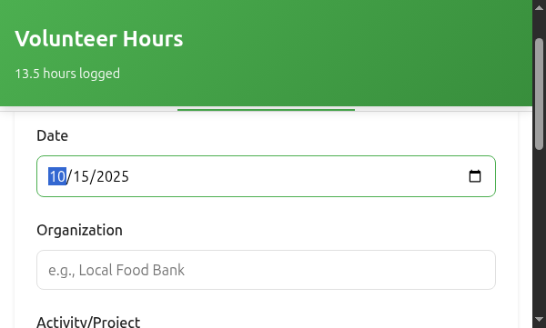

   **Organization** (Required)
   - Name of the organization you volunteered for
   - Examples: "Local Food Bank", "Animal Shelter", "Library"
   - The app will remember and suggest organizations you've used before

   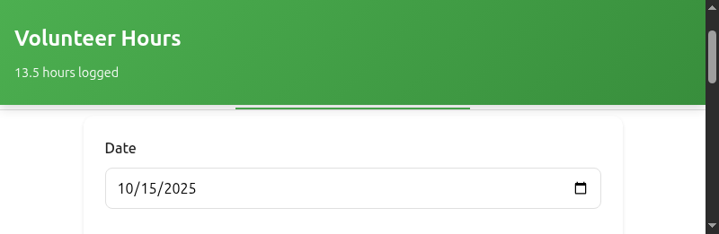

   **Activity/Project** (Required)
   - What you did during your volunteer time
   - Examples: "Food sorting", "Dog walking", "Reading to children"
   - Be specific to help you remember later

   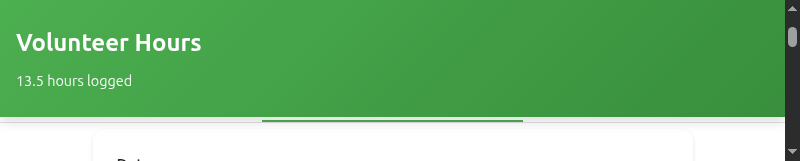

   **Hours** (Required)
   - How long you volunteered
   - Can use decimals (e.g., 2.5 for 2 hours 30 minutes)
   - Minimum: 0.25 hours (15 minutes)

   

3. **Optional Information:**

   **Category** (Optional)
   - Helps organize your volunteer work
   - Choose from: Education, Environment, Health, Social Services, Arts & Culture, Animal Welfare, Community Development, or Other

   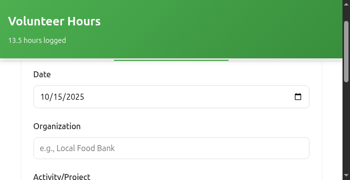

   **Description** (Optional)
   - Add extra details about your volunteer experience
   - Examples: "Sorted 200 lbs of food donations" or "Walked 5 shelter dogs"

   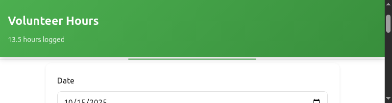

4. **Click "Add Entry"**
   - You'll see a green success message
   - The app automatically switches to the History tab
   - Your entry is saved immediately


### Quick Example

Here's a complete example of logging volunteer hours:

```
Date: October 15, 2024
Organization: Local Food Bank
Activity: Food sorting and distribution
Hours: 3.5
Category: Social Services
Description: Helped sort donations and prepare 50 food packages for families
```

---

## Viewing Your Dashboard

### Understanding Your Statistics

The Dashboard shows four key numbers at the top:

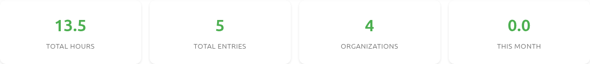

1. **Total Hours**
   - All volunteer hours you've logged
   - Updated automatically when you add entries

2. **Total Entries**
   - Number of volunteer sessions recorded

3. **Organizations**
   - Number of different organizations you've helped

4. **This Month**
   - Hours volunteered in the current month
   - Resets on the 1st of each month

### Hours by Organization Chart

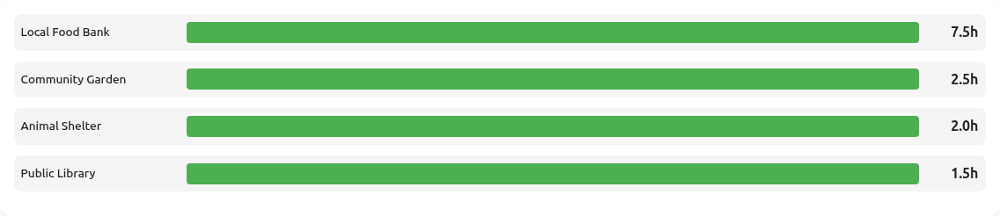

- Visual bar chart showing your top 10 organizations
- Sorted by most hours (largest first)
- Helps you see where you're making the most impact

### Recent Activity

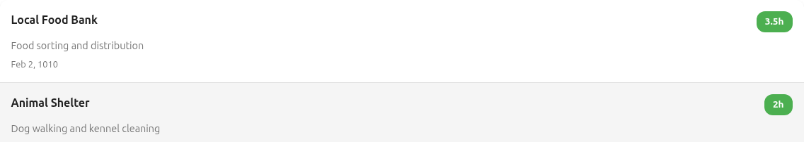

- Shows your last 5 volunteer entries
- Quick overview of what you've been doing
- Displays organization, activity, hours, and date

---

## Managing Your History

### Viewing All Entries

Click the **History** tab to see all your volunteer work.

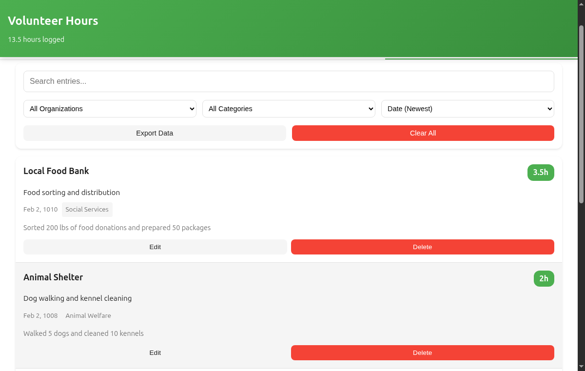

### Searching Your Entries

Use the **search box** at the top to find specific entries:

- Search by organization name: "Food Bank"
- Search by activity: "sorting"
- Search by category: "Health"
- Search by description keywords

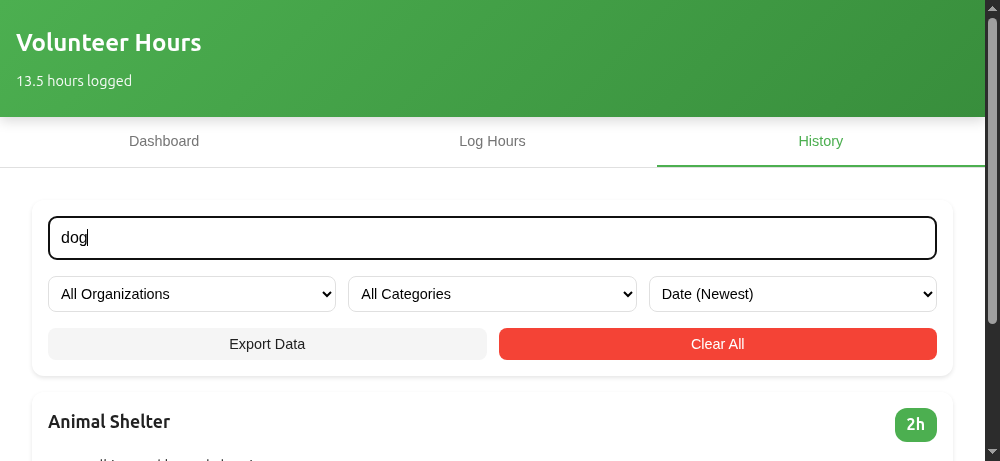

### Filtering Your Entries

**Filter by Organization**
- Dropdown shows all organizations you've worked with
- Select one to see only entries for that organization

**Filter by Category**
- Dropdown shows all categories you've used
- Select one to see only entries in that category

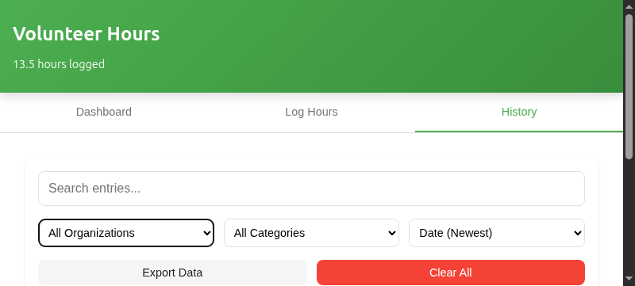

### Sorting Your Entries

Click the **Sort By** dropdown to organize your entries:

- **Date (Newest)** - Most recent entries first (default)
- **Date (Oldest)** - Oldest entries first
- **Hours (Most)** - Highest hours first
- **Hours (Least)** - Lowest hours first

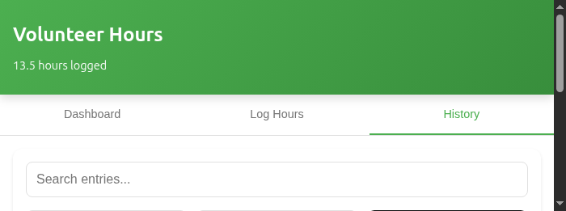

### Editing an Entry

1. Find the entry in your History
2. Click the **Edit** button on that entry
3. The form opens with the entry's information
4. Make your changes
5. Click **Update Entry**
6. Click **Cancel** if you change your mind

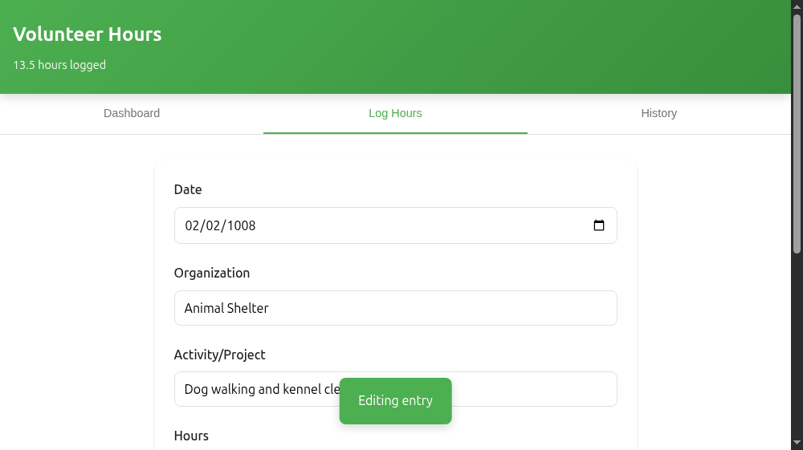

### Deleting an Entry

1. Find the entry in your History
2. Click the **Delete** button on that entry
3. A confirmation popup appears
4. Click **Confirm** to delete (this cannot be undone!)
5. Or click **Cancel** to keep the entry

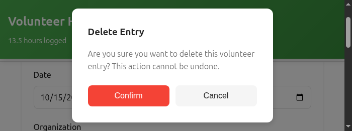

---

## Exporting Your Data

### Why Export?

- Backup your volunteer hours
- Submit hours to your school, employer, or organization
- Move your data to another system
- Keep records for your resume or awards

### How to Export

1. Go to the **History** tab
2. Click the **Export Data** button
3. A JSON file downloads to your computer
4. The filename includes the current date: `volunteer-hours-2024-10-15.json`

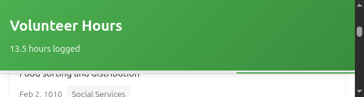

### What's in the Export?

The export file contains all your volunteer entries in JSON format:

```json
[
  {
    "id": "1697385600000",
    "date": "2024-10-15",
    "organization": "Local Food Bank",
    "activity": "Food sorting and distribution",
    "hours": 3.5,
    "category": "Social Services",
    "description": "Helped sort donations and prepare food packages",
    "createdAt": "2024-10-15T14:30:00.000Z"
  }
]
```

### Using Your Export

- **Excel/Sheets**: Open with Google Sheets or Excel (convert JSON first)
- **Email**: Attach to email when reporting hours
- **Backup**: Store in Google Drive, Dropbox, or cloud storage
- **Import**: Can be imported back if you need to restore data

---

## Tips & Best Practices

### 🎯 Recording Hours

✅ **DO:**
- Log hours soon after volunteering (while details are fresh)
- Be specific in activity descriptions
- Include meaningful details in the description field
- Use consistent organization names (e.g., always "Food Bank" not sometimes "The Food Bank")

❌ **DON'T:**
- Forget to log hours - do it right away!
- Use vague activities like "volunteered"
- Enter incorrect hours (can't edit easily if wrong organization selected)

### 📊 Organizing Your Work

✅ **DO:**
- Use categories consistently
- Create meaningful activities that you'll understand later
- Export your data monthly as backup
- Review your dashboard regularly to see your impact

### 📱 Mobile Use

✅ **DO:**
- Install as app on home screen for quick access
- Use immediately after volunteering
- Take advantage of offline capability

### 💾 Backing Up

✅ **DO:**
- Export data monthly
- Store exports in cloud storage
- Keep exports when applying for awards or scholarships

---

## Troubleshooting

### Common Issues

#### "My data disappeared!"

**Cause**: Browser data was cleared, or using incognito/private mode

**Solution**:
- Don't use incognito/private browsing mode
- Export your data regularly as backup
- Check if you're using the same browser
- Look for recent exports you can restore from

#### "The app won't load"

**Solution**:
- Make sure JavaScript is enabled in your browser
- Try a different browser (Chrome, Firefox, Safari)
- Clear your browser cache
- Check the browser console for errors

#### "I can't add decimal hours"

**Solution**:
- Use a period (.) not a comma: `2.5` not `2,5`
- Minimum is 0.25 (15 minutes)

#### "My organization names are messy"

**Solution**:
- Edit old entries to use consistent names
- The app learns from your entries and suggests past organizations
- Use the exact same name each time for an organization

#### "I accidentally deleted an entry"

**Solution**:
- Unfortunately, deletions cannot be undone
- If you have a recent export, you can reference the data there
- Be careful with the Delete button - there's a confirmation for this reason!

#### "The app is slow"

**Solution**:
- Clear old entries you don't need
- Export and clear all data if you have many hundreds of entries
- Close other browser tabs
- Try on a different device

### Getting Help

If you continue to have issues:

1. **Check the FAQ**: See `FAQ.md` for more common questions
2. **Check Browser Compatibility**: Works best on Chrome 90+, Firefox 88+, Safari 14+
3. **Try Another Browser**: Some issues are browser-specific
4. **Check the Console**: Press F12 in your browser and look for errors
5. **Contact Support**: Reach out to your organization's administrator

---

## Privacy & Data Storage

### Where is Your Data?

- **Stored Locally**: All data is stored in your browser's local storage
- **Not Sent Anywhere**: Your data never leaves your device
- **No Account Needed**: No registration or login required
- **Your Control**: You can delete all data anytime

### Security

- ✅ Your data is private to your device
- ✅ XSS protection built-in
- ✅ No tracking or analytics
- ✅ Works completely offline

### Deleting All Data

If you want to completely remove all your volunteer history:

1. Go to **History** tab
2. Click **Clear All** button
3. Confirm the action
4. All data is permanently deleted from your device

⚠️ **Warning**: This cannot be undone! Export your data first if you want to keep it.

---

## Keyboard Shortcuts

Speed up your workflow with these shortcuts:

- **Tab Key**: Move between form fields quickly
- **Enter**: Submit the form when focused on a field
- **Escape**: Close popup modals

---

## Accessibility

The app is designed to be accessible:

- ✅ Keyboard navigation support
- ✅ Screen reader compatible
- ✅ High contrast text
- ✅ Touch-friendly on mobile
- ✅ Large tap targets (44px minimum)

---

## Updates & New Features

This app is continuously improved. Future versions may include:

- 📅 Calendar view of volunteer activities
- 📊 More detailed charts and statistics
- 🏆 Achievement badges and milestones
- 📧 Email reports
- ☁️ Cloud sync (Google Drive)
- 👥 Team/organization features

---

## Appendix: Feature Quick Reference

| Feature | Location | Purpose |
|---------|----------|---------|
| Add Entry | Log Hours tab | Record new volunteer hours |
| View Stats | Dashboard tab | See your total impact |
| Search | History tab | Find specific entries |
| Filter | History tab | Show only certain organizations/categories |
| Sort | History tab | Organize by date or hours |
| Edit | History tab → Edit button | Modify existing entries |
| Delete | History tab → Delete button | Remove entries |
| Export | History tab → Export button | Download all data as JSON |
| Clear All | History tab → Clear All button | Delete all data |

---

**Thank you for using Volunteer Hours Tracker!**

Your volunteer work makes a difference, and we're honored to help you track your impact.

*Questions or feedback? See FAQ.md or contact your administrator.*
